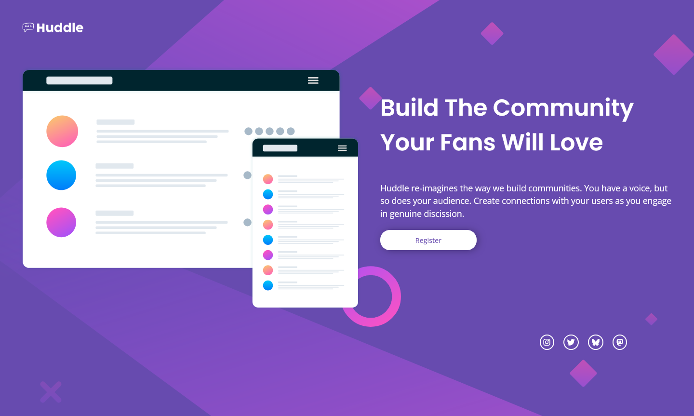

# Frontend Mentor - Huddle landing page with single introductory section solution

This is a solution to the [Huddle landing page with single introductory section challenge on Frontend Mentor](https://www.frontendmentor.io/challenges/huddle-landing-page-with-a-single-introductory-section-B_2Wvxgi0). Frontend Mentor challenges help you improve your coding skills by building realistic projects.

## Table of contents

- [Overview](#overview)
  - [The challenge](#the-challenge)
  - [Screenshot](#screenshot)
  - [Links](#links)
- [My process](#my-process)
  - [Built with](#built-with)
  - [What I learned](#what-i-learned)
  - [Continued development](#continued-development)
- [Author](#author)

## Overview

### The challenge

Users should be able to:

- View the optimal layout for the page depending on their device's screen size
- See hover states for all interactive elements on the page

### Screenshot

Mobile View

Desktop View

### Links

- [Solution URL]()
- [Live Site URL]()

## My process

### Built with

- Semantic HTML5 markup
- CSS custom properties
- Flexbox
- CSS Grid
- Mobile-first workflow

### What I learned

I don't think I learned anything new with the project and instead enjoyed working on it.

### Continued development

I don't plan on continuing this project unless needed. Be sure to check out my other projects I've completed though!

## Author

- [My Portfolio](https://kylecreate.dev/)
- Frontend Mentor - [@kylecreate](https://www.frontendmentor.io/profile/kylecreate)
- BlueSky - [@kylecreate.dev](https://bsky.app/profile/kylecreate.dev)